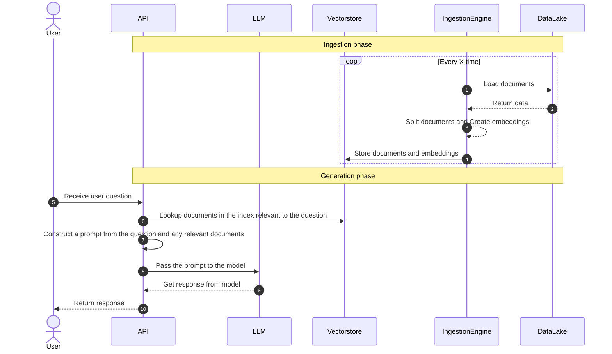

# QnA Bot

Create a question answering over docs bot with one line of code:

```python
from qnabot import QnABot
import os

os.environ["OPENAI_API_KEY"] = "my key"

bot = QnABot(directory="./mydata")
```

### Here's how it works

High level overview what is happening under the hood:


