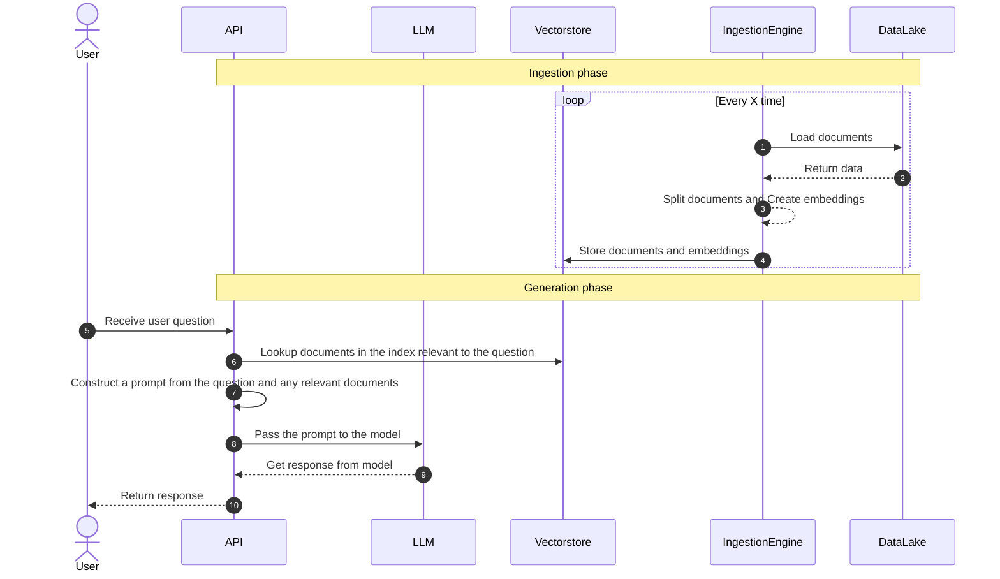

# QnA Bot

Create a question answering over docs bot with one line of code:

```bash
pip install qnabot
```

```python
from qnabot import QnABot
import os

os.environ["OPENAI_API_KEY"] = "my key"

# Create a bot
bot = QnABot(directory="./mydata")

# Ask a question
answer = bot.ask("How do I use this bot?")

# Save the index to save costs (GPT is used to create the index)
bot.save_index("index.pickle")

# Load the index from a previous run
bot = QnABot(directory="./mydata", index="index.pickle")
```

### Future plans

- [ ] Add support for other models
- [ ] Add support for other data sources
- [ ] Add support for other vector databases
- [ ] One line API expose
- [ ] CLI / UI

### Here's how it works

High level overview what is happening under the hood:


