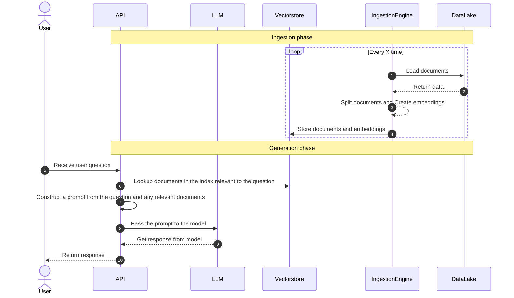

# QnA Bot

[](https://github.com/momegas/qnabot/actions/workflows/python-package.yml)

Create a question answering over docs bot with one line of code:

```bash
pip install qnabot
```

```python
from qnabot import QnABot
import os

os.environ["OPENAI_API_KEY"] = "my key"

# Create a bot 👉 with one line of code
bot = QnABot(directory="./mydata")

# Ask a question
answer = bot.ask("How do I use this bot?")

# Save the index to save costs (GPT is used to create the index)
bot.save_index("index.pickle")

# Load the index from a previous run
bot = QnABot(directory="./mydata", index="index.pickle")
```

You can also create a FastAPI app that will expose the bot as an API using the create_app function.
Assuming you file is called `main.py` run `uvicorn main:app --reload` to run the API locally.
You should then be able to visit `http://localhost:8000/docs` to see the API documentation.

```python
from qnabot import QnABot, create_app

app = create_app(QnABot("./mydata"))
```

You can expose a gradio UI for the bot using `create_interface` function.
Assuming your file is called `ui.py` run `gradio qnabot/ui.py` to run the UI locally.
You should then be able to visit `http://127.0.0.1:7860` to see the API documentation.

```python
from qnabot import QnABot, create_interface

demo = create_interface(QnABot("./mydata"))
```

### Features

- [x] Create a question answering bot over your documents with one line of code using GPT
- [x] Save / load index to reduce costs (Open AI embedings are used to create the index)
- [x] Local data source (directory of documents) or S3 data source
- [x] FAISS for storing vectors / index
- [x] Expose bot over API using FastAPI
- [x] Gradio UI
- [ ] Integration with [guardrails](https://github.com/ShreyaR/guardrails)
- [ ] Integration with [GPTCache](https://github.com/zilliztech/GPTCache)
- [ ] Support for other vector databases (e.g. Weaviate, Pinecone)
- [ ] Customise prompt
- [ ] Support for LLaMA model

### Here's how it works

Large language models (LLMs) are powerful, but they can't answer questions about documents they haven't seen. If you want to use an LLM to answer questions about documents it was not trained on, you have to give it information about those documents. To solve this, we use "retrieval augmented generation."

In simple terms, when you have a question, you first search for relevant documents. Then, you give the documents and the question to the language model to generate an answer. To make this work, you need your documents in a searchable format (an index). This process involves two main steps: (1) preparing your documents for easy querying, and (2) using the retrieval augmented generation method.

`QnABot` uses FAISS to create an index of documents and GPT to generate answers.


