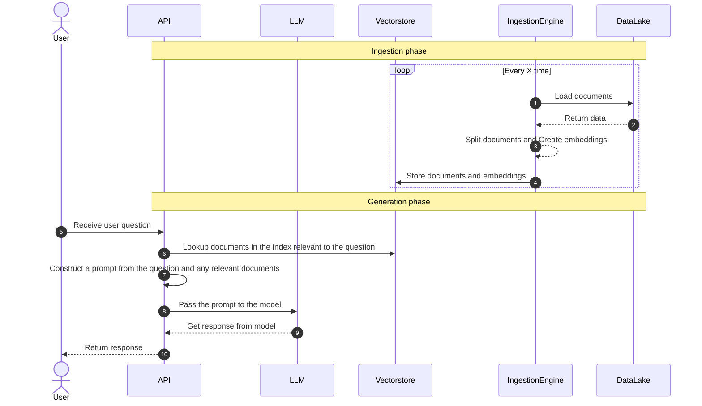

# 🤖 Megabots

[](https://github.com/momegas/qnabot/actions/workflows/python-package.yml)

🤖 Megabots provides State-of-the-art, production ready bots made mega-easy, so you don't have to build them from scratch 🤯 Create a bot, now 🫵

The Megabots library can be used to create bots that:

- ⌚️ are production ready bots in minutes
- 🗂️ can answer questions over documents
- 🧑‍⚕️ can act personal assistants and use agents and tools (Coming soon)
- 🗣️ can accept voice (Coming soon)
- 👍 validate and correct the outputs of large language models (Coming soon)
- 💰 semanticly cache LLM Queries and reduce your LLM API Costs by 10x (Coming soon)
- 🏋️ are mega-easily to train (Coming soon)

🤖 Megabots is backed by some of the most famous tools for productionalising AI. It uses [LangChain](https://docs.langchain.com/docs/) for managing LLM chains, [FastAPI](https://fastapi.tiangolo.com/) to create a production ready API, [Gradio](https://gradio.app/) to create a UI. At the moment it uses [OpenAI](https://openai.com/) to generate answers, but we plan to support other LLMs in the future.

Note: This is a work in progress. The API might change.

```bash
pip install megabots
```

```python
from megabots import bot
import os

os.environ["OPENAI_API_KEY"] = "my key"

# Create a bot 👉 with one line of code. Automatically loads your data from ./index or index.pkl.
qnabot = bot("qna-over-docs")

# Ask a question
answer = bot.ask("How do I use this bot?")

# Save the index to save costs (GPT is used to create the index)
bot.save_index("index.pkl")

# Load the index from a previous run
qnabot = bot("qna-over-docs", index="./index.pkl")

# Or create the index from a directory of documents
qnabot = bot("qna-over-docs", index="./index")

# Change the model
qnabot = bot("qna-over-docs", model="text-davinci-003")

# Change the prompt
prompt_template = "Be humourous in your responses. Question: {question}\nContext: {context}, Answer:"
prompt_variables=["question", "context"]
qnabot = bot("qna-over-docs", prompt_template=prompt_template, prompt_variables=prompt_variables)
```

You can also create a FastAPI app that will expose the bot as an API using the create_app function.
Assuming you file is called `main.py` run `uvicorn main:app --reload` to run the API locally.
You should then be able to visit `http://localhost:8000/docs` to see the API documentation.

```python
from megabots import bot, create_api

app = create_app(bot("qna-over-docs"))
```

You can expose a gradio UI for the bot using `create_interface` function.
Assuming your file is called `ui.py` run `gradio qnabot/ui.py` to run the UI locally.
You should then be able to visit `http://127.0.0.1:7860` to see the API documentation.

```python
from megabots import bot, create_interface

demo = create_interface(bot("qna-over-docs"))
```

# Customising bot

The `bot` function should serve as the starting point for creating and customising your bot. Below is a list of the available arguments in `bot`.

| Argument         | Description                                                                                                                                                                                                                                                                                |
| ---------------- | ------------------------------------------------------------------------------------------------------------------------------------------------------------------------------------------------------------------------------------------------------------------------------------------ |
| task             | The type of bot to create. Available options: `qna-over-docs`. More comming soon                                                                                                                                                                                                           |
| index            | Specifies the index to use for the bot. It can either be a saved index file (e.g., `index.pkl`) or a directory of documents (e.g., `./index`). In the case of the directory the index will be automatically created. If no index is specified `bot` will look for `index.pkl` or `./index` |
| model            | The name of the model to use for the bot. You can specify a different model by providing its name, like "text-davinci-003". Supported models: `gpt-3.5-turbo` (default),`text-davinci-003` More comming soon.                                                                              |
| prompt_template  | A string template for the prompt, which defines the format of the question and context passed to the model. The template should include placeholders for the variables specified in `prompt_variables`.                                                                                    |
| prompt_variables | A list of variables to be used in the prompt template. These variables are replaced with actual values when the bot processes a query.                                                                                                                                                     |
| sources          | When `sources` is `True` the bot will also include sources in the response. A known [issue](https://github.com/hwchase17/langchain/issues/2858) exists, where if you pass a custom prompt with sources the code breaks.                                                                    |

### How QnA bot works

Large language models (LLMs) are powerful, but they can't answer questions about documents they haven't seen. If you want to use an LLM to answer questions about documents it was not trained on, you have to give it information about those documents. To solve this, we use "retrieval augmented generation."

In simple terms, when you have a question, you first search for relevant documents. Then, you give the documents and the question to the language model to generate an answer. To make this work, you need your documents in a searchable format (an index). This process involves two main steps: (1) preparing your documents for easy querying, and (2) using the retrieval augmented generation method.

`qna-over-docs` uses FAISS to create an index of documents and GPT to generate answers.


