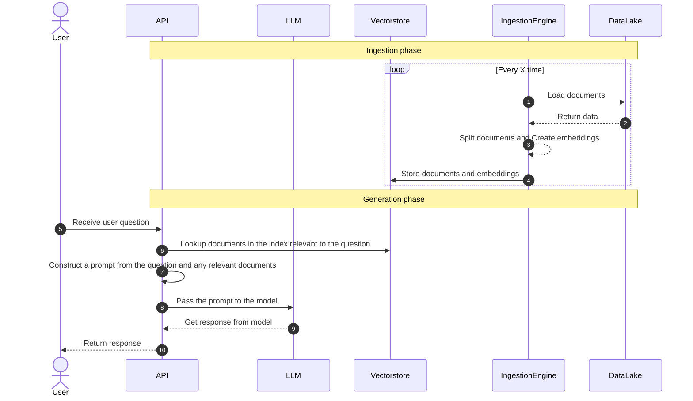

# 🤖 Megabots

[](https://github.com/momegas/qnabot/actions/workflows/python-package.yml)
[](#supported-python-versions)
[](https://github.com/psf/black)
[](https://github.com/momegas/megabots/blob/main/LICENCE)


🤖 Megabots provides State-of-the-art, production ready LLM apps made mega-easy, so you don't have to build them from scratch 🤯 Create a bot, now 🫵

- 👉 Join us on Discord: https://discord.gg/zkqDWk5S7P
- ✈️ Work is managed in this project: https://github.com/users/momegas/projects/5/views/2
- 🤖 Documentation bot: https://huggingface.co/spaces/momegas/megabots

**The Megabots library can be used to create bots that:**

- ⌚️ are production ready, in minutes
- 🗂️ can answer questions over documents
- 💾 can connect to vector databases
- 🎖️ automatically expose the bot as a rebust API using FastAPI (early release)
- 🏓 automatically expose the bot as a UI using Gradio

**Coming soon:**

- 🗣️ accept voice as an input using [whisper](https://github.com/openai/whisper)
- 👍 validate and correct the outputs of LLMs using [guardrails](https://github.com/ShreyaR/guardrails)
- 💰 semanticly cache LLM Queries and reduce Costs by 10x using [GPTCache](https://github.com/zilliztech/GPTCache)
- 🏋️ mega-easy LLM training
- 🚀 mega-easy deployment

🤖 Megabots is backed by some of the most famous tools for productionalising AI. It uses [LangChain](https://docs.langchain.com/docs/) for managing LLM chains, [langchain-serve](https://github.com/jina-ai/langchain-serve) to create a production ready API, [Gradio](https://gradio.app/) to create a UI. At the moment it uses [OpenAI](https://openai.com/) to generate answers, but we plan to support other LLMs in the future.

## Getting started

Note: This is a work in progress. The API might change.

```bash
pip install megabots
```

```python
from megabots import bot
import os

os.environ["OPENAI_API_KEY"] = "my key"

# Create a bot 👉 with one line of code. Automatically loads your data from ./index or index.pkl.
# Keep in mind that you need to have one or another.
qnabot = bot("qna-over-docs")

# Ask a question
answer = bot.ask("How do I use this bot?")

# Save the index to save costs (GPT is used to create the index)
bot.save_index("index.pkl")

# Load the index from a previous run
qnabot = bot("qna-over-docs", index="./index.pkl")

# Or create the index from a directory of documents
qnabot = bot("qna-over-docs", index="./index")

# Change the model
qnabot = bot("qna-over-docs", model="text-davinci-003")
```

## Changing the bot's prompt

You can change the bots promnpt to customize it to your needs. In the `qna-over-docs` type of bot you will need to pass 2 variables for the `context` (knwoledge searched from the index) and the `question` (the human question).

```python
from megabots import bot

prompt = """
Use the following pieces of context to answer the question at the end.
If you don't know the answer, just say that you don't know, don't try to make up an answer.
Answer in the style of Tony Stark.

{context}

Question: {question}
Helpful humorous answer:"""

qnabot = bot("qna-over-docs", index="./index.pkl", prompt=prompt)

qnabot.ask("what was the first roster of the avengers?")
```

## Working with memory

You can easily add memory to your `bot` using the `memory` parameter. It accepts a string with the type of the memory to be used. This defaults to some sane dafaults.
Should you need more configuration, you can use the `memory` function and pass the type of memory and the configuration you need.

```python
from megabots import bot

qnabot = bot("qna-over-docs", index="./index.pkl", memory="conversation-buffer")

print(qnabot.ask("who is iron man?"))
print(qnabot.ask("was he in the first roster?"))
# Bot should understand who "he" refers to.
```

Or using the `memory`factory function

```python
from megabots import bot, memory

mem("conversation-buffer-window", k=5)

qnabot = bot("qna-over-docs", index="./index.pkl", memory=mem)

print(qnabot.ask("who is iron man?"))
print(qnabot.ask("was he in the first roster?"))
```

NOTE: For the `qna-over-docs` bot, when using memory and passing your custom prompt, it is important to remember to pass one more variable to your custom prompt to facilitate for chat history. The variable name is `history`.

```python
from megabots import bot

prompt = """
Use the following pieces of context to answer the question at the end.
If you don't know the answer, just say that you don't know, don't try to make up an answer.

{context}

{history}
Human: {question}
AI:"""

qnabot = bot("qna-over-docs", prompt=prompt, index="./index.pkl", memory="conversation-buffer")

print(qnabot.ask("who is iron man?"))
print(qnabot.ask("was he in the first roster?"))
```

## Using Megabots with Milvus (more DBs comming soon)

Megabots `bot` can also use Milvus as a backend for its search engine. You can find an example of how to do it below.

In order to run Milvus you need to follow [this guide](https://milvus.io/docs/example_code.md) to download a docker compose file and run it.
The command is:

```bash
wget https://raw.githubusercontent.com/milvus-io/pymilvus/v2.2.7/examples/hello_milvus.py
```

You can then [install Attu](https://milvus.io/docs/attu_install-docker.md) as a management tool for Milvus

```python
from megabots import bot

# Attach a vectorstore by passing the name of the database. Default port for milvus is 19530 and default host is localhost
# Point it to your files directory so that it can index the files and add them to the vectorstore
bot = bot("qna-over-docs", index="./examples/files/", vectorstore="milvus")

bot.ask("what was the first roster of the avengers?")
```

Or use the `vectorstore` factory function for more customisation

```python

from megabots import bot, vectorstore

milvus = vectorstore("milvus", host="localhost", port=19530)

bot = bot("qna-over-docs", index="./examples/files/", vectorstore=milvus)
```

## Exposing an API with [langchain-serve](https://github.com/jina-ai/langchain-serve)

You can also expose the bot endpoints locally using langchain-serve. A sample file `api.py` is provided in the `megabots` folder.

To expose the API locally, you can do 
```bash
lc-serve deploy local megabots.api
```

You should then be able to visit `http://localhost:8000/docs` to see & interact with the API documentation.

To deploy your API to the cloud, you can do and connect to the API using the endpoint provided in the output.
```bash
lc-serve deploy jcloud megabots.api
```

<details>
<summary>Show command output</summary>

```text
╭──────────────┬──────────────────────────────────────────────────────────────────────────────────────╮
│ App ID       │                                 langchain-dec14439a6                                 │
├──────────────┼──────────────────────────────────────────────────────────────────────────────────────┤
│ Phase        │                                       Serving                                        │
├──────────────┼──────────────────────────────────────────────────────────────────────────────────────┤
│ Endpoint     │                      https://langchain-dec14439a6.wolf.jina.ai                       │
├──────────────┼──────────────────────────────────────────────────────────────────────────────────────┤
│ App logs     │                               dashboards.wolf.jina.ai                                │
├──────────────┼──────────────────────────────────────────────────────────────────────────────────────┤
│ Swagger UI   │                    https://langchain-dec14439a6.wolf.jina.ai/docs                    │
├──────────────┼──────────────────────────────────────────────────────────────────────────────────────┤
│ OpenAPI JSON │                https://langchain-dec14439a6.wolf.jina.ai/openapi.json                │
╰──────────────┴──────────────────────────────────────────────────────────────────────────────────────╯
```
</details>


You can read more about langchain-serve [here](https://github.com/jina-ai/langchain-server).

## Exposing a Gradio chat-like interface

You can expose a gradio UI for the bot using `create_interface` function.
Assuming your file is called `ui.py` run `gradio qnabot/ui.py` to run the UI locally.
You should then be able to visit `http://127.0.0.1:7860` to see the API documentation.

```python
from megabots import bot, create_interface

demo = create_interface(bot("qna-over-docs"))
```

## Customising bot

The `bot` function should serve as the starting point for creating and customising your bot. Below is a list of the available arguments in `bot`.

| Argument    | Description                                                                                                                                                                                                                                                                                |
| ----------- | ------------------------------------------------------------------------------------------------------------------------------------------------------------------------------------------------------------------------------------------------------------------------------------------ |
| task        | The type of bot to create. Available options: `qna-over-docs`. More comming soon                                                                                                                                                                                                           |
| index       | Specifies the index to use for the bot. It can either be a saved index file (e.g., `index.pkl`) or a directory of documents (e.g., `./index`). In the case of the directory the index will be automatically created. If no index is specified `bot` will look for `index.pkl` or `./index` |
| model       | The name of the model to use for the bot. You can specify a different model by providing its name, like "text-davinci-003". Supported models: `gpt-3.5-turbo` (default),`text-davinci-003` More comming soon.                                                                              |
| prompt      | A string template for the prompt, which defines the format of the question and context passed to the model. The template should include placeholder variables like so: `context`, `{question}` and in the case of using memory `history`.                                                  |
| memory      | The type of memory to be used by the bot. Can be a string with the type of the memory or you can use `memory` factory function. Supported memories: `conversation-buffer`, `conversation-buffer-window`                                                                                    |
| vectorstore | The vectorstore to be used for the index. Can be a string with the name of the databse or you can use `vectorstore` factory function. Supported DBs: `milvus`.                                                                                                                             |

| sources | When `sources` is `True` the bot will also include sources in the response. A known [issue](https://github.com/hwchase17/langchain/issues/2858) exists, where if you pass a custom prompt with sources the code breaks. |

## How QnA bot works

Large language models (LLMs) are powerful, but they can't answer questions about documents they haven't seen. If you want to use an LLM to answer questions about documents it was not trained on, you have to give it information about those documents. To solve this, we use "retrieval augmented generation."

In simple terms, when you have a question, you first search for relevant documents. Then, you give the documents and the question to the language model to generate an answer. To make this work, you need your documents in a searchable format (an index). This process involves two main steps: (1) preparing your documents for easy querying, and (2) using the retrieval augmented generation method.

`qna-over-docs` uses FAISS to create an index of documents and GPT to generate answers.



## How to contribute?

We welcome any suggestions, problem reports, and contributions!
For any changes you would like to make to this project, we invite you to submit an [issue](https://github.com/momegas/megabots/issues).

For more information, see [`CONTRIBUTING`](https://github.com/momegas/megabots/blob/main/CONTRIBUTING.md) instructions.
