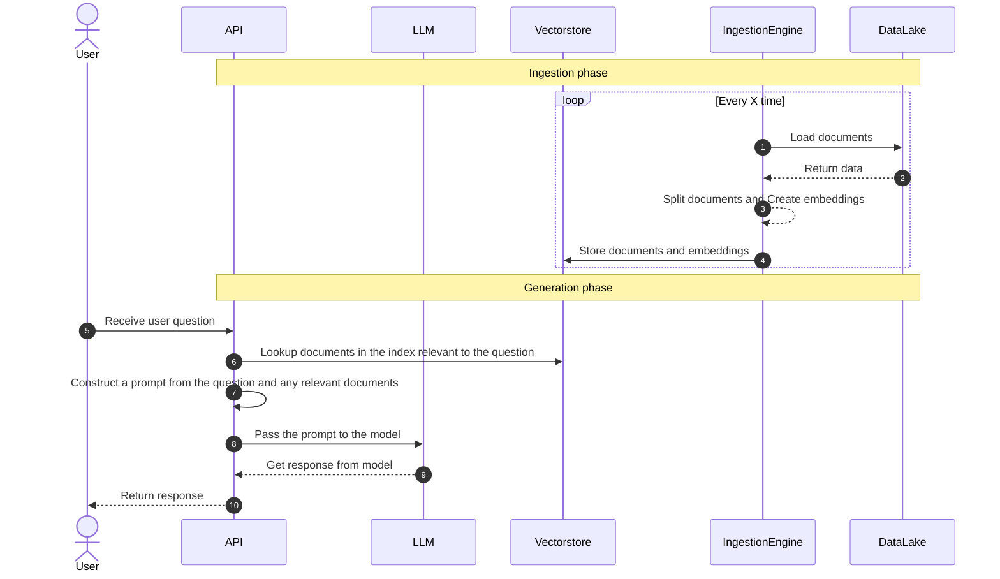

## Introduction

Welcome to the Megabots documentation on GitHub! Megabots is a powerful Python library for building and testing modular robots. It is designed to provide a simple and intuitive interface for developers to create complex robots with ease.

This documentation aims to provide comprehensive guidance on how to use Megabots, from installation and configuration to advanced usage scenarios. Whether you are a seasoned developer or just getting started with robotics, this documentation will provide you with the knowledge you need to build and test your own robots using Megabots.

To get started, take a look at the installation guide to set up Megabots on your system. Then, explore the user guide to learn about the various components and features of Megabots, such as sensors, actuators, and controllers. Finally, the API reference provides detailed information on the functions and classes available in Megabots.

We hope you find this documentation helpful in using Megabots to create amazing robots. If you have any questions or feedback, please don't hesitate to reach out to us through our GitHub page. Happy creating!

## How QnA bot works

Large language models (LLMs) are powerful, but they can't answer questions about documents they haven't seen. If you want to use an LLM to answer questions about documents it was not trained on, you have to give it information about those documents. To solve this, we use "retrieval augmented generation."

In simple terms, when you have a question, you first search for relevant documents. Then, you give the documents and the question to the language model to generate an answer. To make this work, you need your documents in a searchable format (an index). This process involves two main steps: (1) preparing your documents for easy querying, and (2) using the retrieval augmented generation method.

`qna-over-docs` uses FAISS to create an index of documents and GPT to generate answers.

